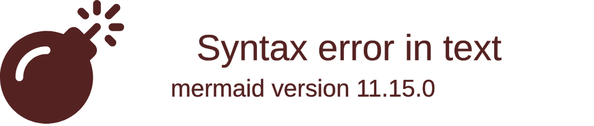
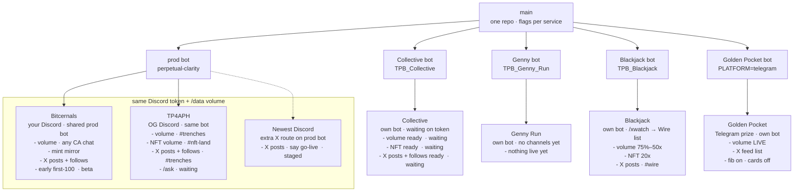
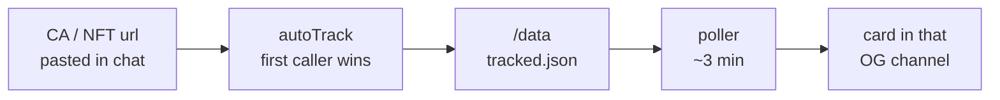

# Architecture

Generated from [`ops-map.json`](ops-map.json). Do not hand-edit — run `node scripts/render-ops-map.mjs`.

Bitcernals + TP4APH = ONE Discord bot and ONE /data volume. Collective, Genny, and Blackjack get their own bot. Never put their channels on perpetual-clarity.

## New architecture (`architecture-beta`)

Cloud-style groups: one box per Railway project. Server = bot, database = volume, internet = Discord/TG. Needs Mermaid 11.1+ (GitHub has it; if Cursor preview is a blank box, use the flowchart below).

## Topology (flowchart)

Feature lists live here. Dashed line = staged.

## Volume bot

Every instance runs this path. Alerts go to the channel that first tracked the CA.

