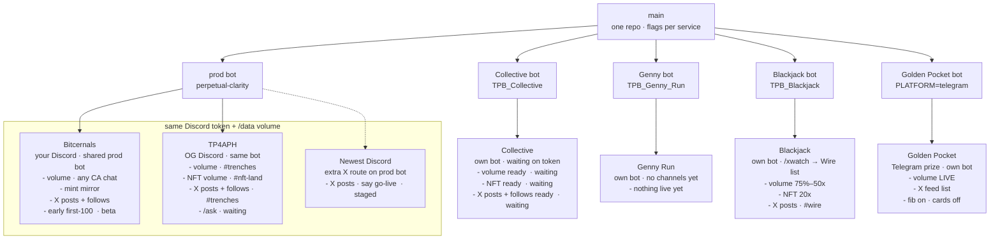
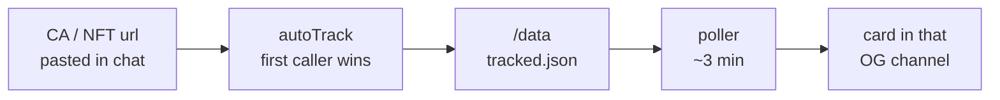

# Ops map — which Discord / TG has which features

Whiteboard: [`ops-map.excalidraw`](ops-map.excalidraw) · flowchart: [`ops-map.drawio`](ops-map.drawio) · architecture: [`ARCHITECTURE.md`](ARCHITECTURE.md) (Mermaid)
Data: [`ops-map.json`](ops-map.json)  ← **source of truth**
This file: IDs, when to update, how to call the agent.

The picture is **islands + chips**. Snowflake IDs stay in the inventory below — they do not belong on the whiteboard. If picture and inventory disagree, **JSON wins**. Re-render. Do not hand-draw the generated files.

---

## Open the visual

**Excalidraw (the cracked-coder one):** extension `pomdtr.excalidraw-editor` → open `docs/ops-map.excalidraw`. Cream paper, handwritten, one board per community.

**Tecture (Cursor-native):** `architecture/` — Command Palette → **Tecture: Open Architecture**. C4 drill-down (system → containers → prod-bot components). This is the maintained architecture, not Draw.io.

**Mermaid architecture:** [`ARCHITECTURE.md`](ARCHITECTURE.md) — GitHub preview fallback.

**Draw.io flowchart:** reopen `docs/ops-map.drawio` if you want to drag boxes. Close the tab first if it is stale.

---

## Call this (agent)

Say `update the ops map` / `ops map` / `which Discord has X`.

That follows [`.cursor/skills/ops-map/SKILL.md`](../.cursor/skills/ops-map/SKILL.md), patches JSON, then:

```bash
node scripts/render-ops-map.mjs
```

---

## When to update (same day)

| You just… | Update? |
|---|---|
| Added a Discord or Telegram community | Yes — new island |
| Turned a flag on/off | Yes — chip appears or disappears |
| New channel ID | Yes — `chip` text + ID in inventory |
| Staged → live / token landed | Yes |
| Code-only, same flags | No |

Bump `updated` in `ops-map.json`. `chip` is the short whiteboard label (`volume · #trenches`). `lines` are the ID dump for this file. Off features have **no chip** — blank space is the signal.

---

## How to edit without going stale

1. Edit **only** `docs/ops-map.json`.
2. Status: `live` `beta` `staged` `waiting` `off` `none`.
3. No tokens / cookies / API keys in JSON.
4. `node scripts/render-ops-map.mjs`
5. Glance at the island you changed.

Do not hand-edit `.excalidraw`, `.drawio`, or `ARCHITECTURE.md`. Do not put Collective / Genny channels on `perpetual-clarity`. A second TG group is a new Railway service, not another chat on Golden Pocket.

---

## Tricks

**Why this shape.** Architecture in git is Mermaid (`ARCHITECTURE.md`). Whiteboards are Excalidraw. Draw.io is if you want to drag. JSON is the memory.

**Copy IDs.** Discord Developer Mode → right-click channel. Telegram supergroup IDs are negative strings.

**Shared bot is the trap.** Bitcernals + TP4APH share one Railway service and one `tracked.json`. That is the red dashed box. Collective is a new Discord app on purpose.

**X is `listId:channelId`.** Posts from the list, follows from `/xwatch` + a per-guild store. Two communities on one list = the same tweets in both channels.

**Railway env beats git.** Map disagrees with Railway → fix JSON to match Railway (never paste secrets), re-render.

**Newest Discord is not an instance.** Staged extra `XFEED_ROUTES` row on the prod bot. Policy exception until you say go-live.

**Early is not a channel.** `/early` replies in-command. `early/` is not wired into `index.js` yet.

**Golden Pocket is Telegram-only.** Chat ID is Railway `SUMMARY_CHANNEL_ID`, not in git.

---

## Related

- [NEW_INSTANCE.md](NEW_INSTANCE.md) — how to stand up a community (naming, isolation, Collective / Blackjack appendix)
- [instances.json](instances.json) — instance registry (Railway IDs, channels, X lists — no secrets)
- [X_LISTS.md](X_LISTS.md) — X list → Discord channel
- [GITHUB_PRACTICES.md](../GITHUB_PRACTICES.md) — flag defaults per Discord vs Telegram
- [`.env.example`](../.env.example) — every env var

---

## Architecture (generated Mermaid)

<!-- OPS_MAP_MERMAID_START -->

### New architecture


### Topology



### Volume bot



<!-- OPS_MAP_MERMAID_END -->

---

## Inventory (generated — do not hand-edit between the markers)

<!-- OPS_MAP_INVENTORY_START -->

**Last updated:** 2026-09-04

Bitcernals + TP4APH = ONE Discord bot and ONE /data volume. Collective, Genny, and Blackjack get their own bot. Never put their channels on perpetual-clarity.

### Communities

| Community | Platform | Status |
|---|---|---|
| Bitcernals | Discord | LIVE · test |
| TP4APH | Discord | LIVE · OG |
| Newest Discord | Discord | STAGED |
| Collective | Discord | WAITING |
| Genny Run | Discord | NEW |
| Blackjack | Discord | LIVE |
| Golden Pocket | Telegram | LIVE · prize |

### Feature × community (IDs live here — not on the whiteboard)

| Feature | Bitcernals | TP4APH | Newest Discord | Collective | Genny Run | Blackjack | Golden Pocket |
|---|---|---|---|---|---|---|---|
| Railway / bot | **LIVE**<br>SHARED prod bot<br>perpetual-clarity<br>take_profits_profit_bot<br>guild = GUILD_ID (BitCERNials) | **LIVE**<br>SHARED prod bot<br>same service as Personal<br>guild 1358929055105159229 | **STAGED**<br>would ride SHARED prod bot<br>extra XFEED_ROUTES row<br>say "go live" first | **WAITING**<br>OWN bot — never prod token<br>TPB_Collective<br>Discord_Collective<br>needs DISCORD_TOKEN | **WAITING**<br>OWN bot<br>TPB_Genny_Run<br>Discord_Genny_Run<br>TG later, same project | **LIVE**<br>OWN bot — never prod token<br>TPB_Blackjack<br>Discord_Blackjack<br>guild 855079121822285864 | **LIVE**<br>OWN Telegram bot<br>TG_1_Golden_Pocket_TPB<br>Golden_Pocket_TG_Take_Profits_Bot<br>PLATFORM=telegram |
| Memecoin TP (volume bot) | **LIVE**<br>Wherever CAs are pasted<br>(except blocked channels)<br>same volume as TP4APH | **LIVE**<br>#trenches (CA paste)<br>1452152164699869298<br>alerts follow first channel | **—**<br>not configured | **WAITING**<br>env ready<br>CAs → same channel they were pasted in | **—**<br>channel IDs not set | **LIVE**<br>MILESTONE_MAX_TIER=50<br>paste CAs in 1542691157413466172<br>alerts follow the paste channel | **LIVE**<br>volume / take-profits LIVE<br>chat = SUMMARY_CHANNEL_ID<br>(Railway only — not in git) |
| NFT take-profits | **OFF**<br>NFT_TP_CHANNEL_IDS is<br>TP #nft-land only<br>not this Discord | **LIVE**<br>#nft-land<br>1358929055604408465<br>CA mute — no token track | **—**<br>not configured | **WAITING**<br>NFT_TP_ENABLED=true<br>1365097408387612782 | **—**<br>channel IDs not set | **LIVE**<br>NFT_TP_ENABLED=true<br>1542691157413466172 | **OFF**<br>unset |
| Mint scanner | **LIVE**<br>dev mirror channel<br>1536502941924593827<br>nft-land no longer mirrored | **OFF**<br>nft-land is volume-bot only<br>mint cards stay on personal mirror<br>1536502941924593827 | **—**<br>not configured | **OFF**<br>MINT_SCANNER_ENABLED=false | **OFF**<br>leave off until asked | **OFF**<br>MINT_SCANNER_ENABLED=false | **OFF**<br>unset |
| X posts / comments | **LIVE**<br>personal X channel<br>1541180128564875304<br>list 2091751129990541339 | **LIVE**<br>#trenches<br>1452152164699869298<br>list 2055706691925381501 | **STAGED**<br>channel 1536498340609527922<br>list 2091751648930771381<br>do not add until go-live | **WAITING**<br>1365097408387612782<br>list 2091750809780592842 | **OFF**<br>leave off until asked | **LIVE**<br>1543083831601528862<br>list 2093191150190399663<br>/xwatch adds to this list | **LIVE**<br>Golden Pocket X feed list<br>2094619215005163531<br>chat = SUMMARY_CHANNEL_ID<br>posts / comments / replies |
| X follows | **LIVE**<br>same channel<br>1541180128564875304<br>store db.xRadar | **LIVE**<br>#trenches<br>1452152164699869298<br>empty db.xRadarTp until /xwatch in this guild | **—**<br>not configured | **WAITING**<br>1365097408387612782<br>own /data store | **OFF**<br>leave off until asked | **LIVE**<br>1543083831601528862<br>own /data store<br>/xwatch → list 2093191150190399663 | **LIVE**<br>same chat as memecoin<br>admins /xwatch<br>syncs onto X feed list |
| Early first-100 minters + follows | **BETA**<br>early/ in repo<br>NOT wired in index.js<br>/early — no channel yet | **OFF**<br>not deployed | **OFF**<br>not deployed | **OFF**<br>not deployed | **OFF**<br>not deployed | **OFF**<br>not deployed | **OFF**<br>Discord slash only |
| Fib / golden pocket | **LIVE**<br>code default ON<br>alerts follow the CA channel | **LIVE**<br>code default ON<br>alerts follow the CA channel | **—**<br>not configured | **WAITING**<br>code default ON once live | **—**<br>default ON once live | **WAITING**<br>code default ON once live | **LIVE**<br>AUTO_FIB_TRACKING in TG example<br>ALERT_CARDS_ENABLED=false |
| Knowledge /ask | **OFF**<br>KB_GUILD_ID is TP4APH<br>keep personal archive out | **WAITING**<br>KB_ENABLED to launch<br>guild 1358929055105159229<br>archive #trenches | **OFF**<br>not this guild | **OFF**<br>leave KB unset | **OFF**<br>leave KB unset | **OFF**<br>leave KB unset | **OFF**<br>must stay unset |
| Logs / blocked | **LIVE**<br>banner/recap share TP env<br>blocked 1536177376508121088<br>warden 1484009058401910844 | **LIVE**<br>LOG/SUMMARY default<br>1452152164699869298<br>Warden = separate service | **—**<br>not configured | **WAITING**<br>LOG + SUMMARY<br>1365097408387612782<br>split channels later | **—**<br>need their LOG/SUMMARY IDs | **LIVE**<br>LOG + SUMMARY<br>1542691157413466172<br>split channels later | **LIVE**<br>SUMMARY_CHANNEL_ID = chat<br>do not add a second TG group<br>to this bot |

<!-- OPS_MAP_INVENTORY_END -->
